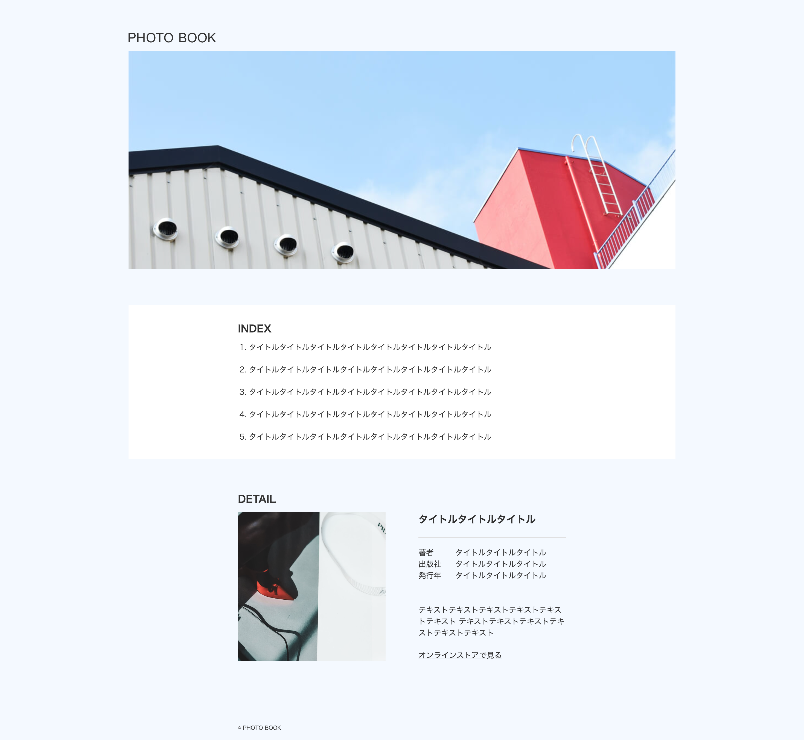

# フォトサイト - WordPressオリジナルテーマ制作

codejumpの模写練習19つ目です。
https://code-jump.com/photo-menu-wp/

## 🚀 制作ステータス
- **制作日**: 2026-03-10
- **対応範囲**: WordPressテーマ開発、固定ページ連携
- **スクリーンショット**: 

## 🛠 習得・活用テクニック

### 1. WordPressの習熟と開発スピードの向上
前作での基礎学習を活かし、環境構築からテーマ化までのフローをスムーズに完遂。WordPressのテンプレート構造やPHPの記述に対する理解を深めた。

### 2. 固定ページとの連動（テンプレート化）
index（トップページ）のコンテンツをWordPressの管理画面（固定ページ）から編集・更新できる仕組みを実装。静的コーディングにはない、CMSとしての柔軟な運用性を実現した。

### 3. 動的コンテンツの出力制御
固定ページで入力された情報を、PHPテンプレートを介して意図したレイアウト通りにフロントエンドへ出力するテンプレートタグの活用。

---
Created by kana10 on 2026-03-10